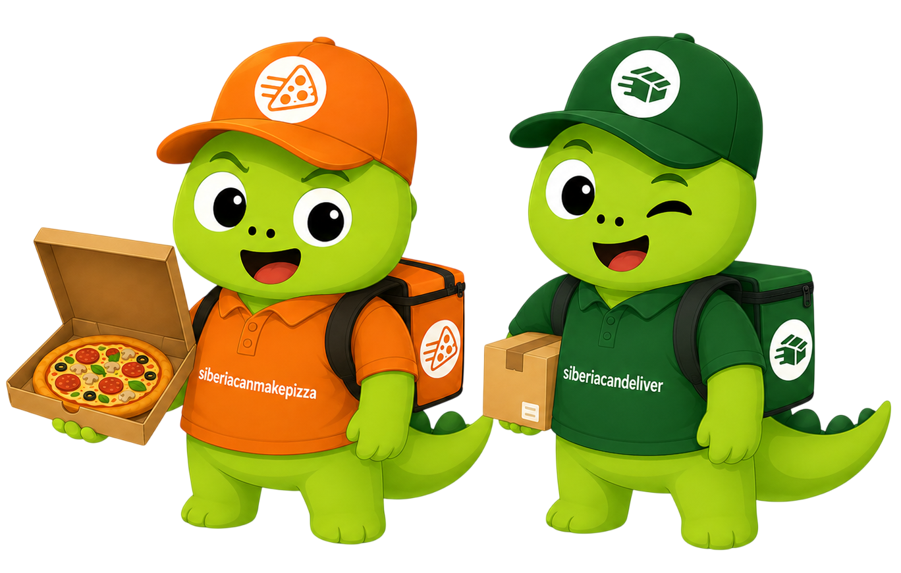

  <a href="https://siberiacancode.github.io/reactuse/">
    <picture>
      
    </picture>
  </a>
  <h1>🐣👾 Pet Projects × juniorsbootcamp</h1>

Коллекция пет-проектов для исследования и сравнения технологий в мире фронтенда. Все проекты построены на **React**, но каждый исследует разные UI-библиотеки, подходы к стейт-менеджменту, формам, роутингу и другим инструментам экосистемы.

## 👾 juniorsbootcamp

Идеи и задания для проектов взяты с [juniorsbootcamp.ru](https://juniorsbootcamp.ru/) — платформы с подборкой проектов для исследования разных подходов во фронтенд-разработке.

## 📦 Проекты

### 1. 🚚 [Delivery Project](delivery-project/README.md)

Приложение для оформления и отслеживания доставки посылок. Пошаговое оформление заказа, история отправлений, отслеживание по номеру.

**Стек:**
- **React 19** + **React Router v7**
- **TypeScript**
- **TanStack Query**
- **React Hook Form** + **Zod** — формы и валидация
- **Tailwind CSS v4** + **shadcn/ui (Base UI)** — UI
- **@siberiacancode/apicraft** — кодогенерация API
- **@siberiacancode/reactuse** — React хуки
- **pnpm**

[→ Подробнее](delivery-project/README.md)
