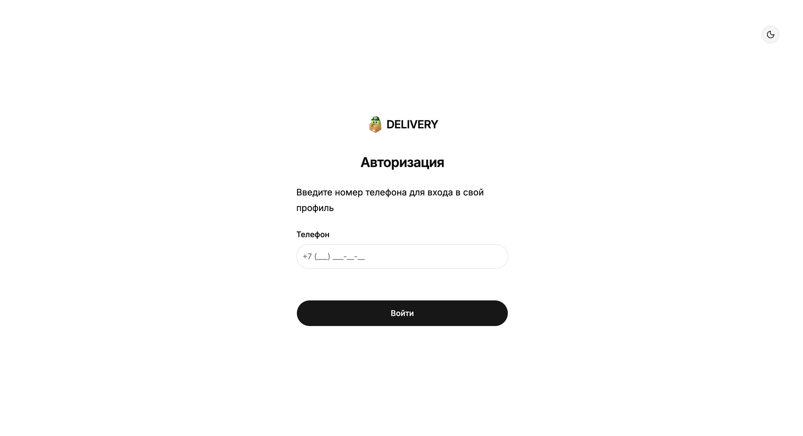
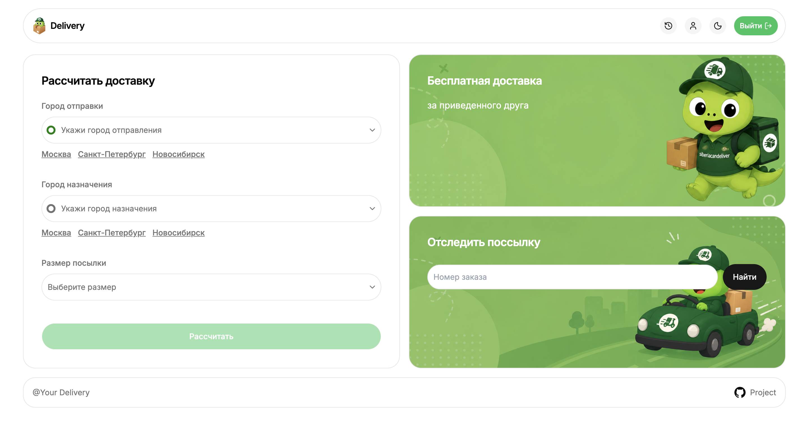
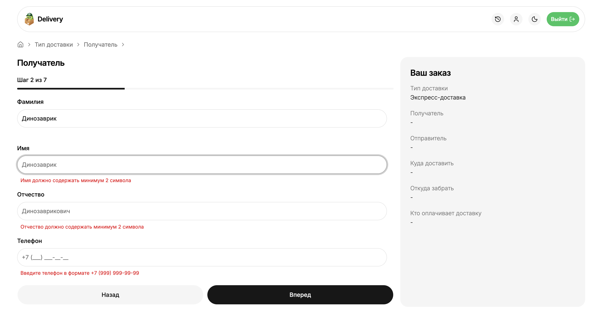

# 🚚 Delivery Project

Учебное fullstack-приложение для оформления и отслеживания доставки посылок.

## 🛠️ Стек

- **React 19** + **React Router v7**
- **TypeScript**
- **TanStack Query**
- **React Hook Form** + **Zod** — формы и валидация
- **Tailwind CSS v4** + **shadcn/ui (Base UI)** — UI
- **Axios** + **@siberiacancode/apicraft** — кодогенерация API
- **Sonner** — уведомления
- **pnpm**

## 📸 Скриншоты







## ✨ Функциональность

- Авторизация (защищённые маршруты)
- Расчёт стоимости доставки по городам и размеру посылки
- Оформление заказа — пошаговый флоу:
  1. Тип доставки
  2. Адрес отправителя
  3. Адрес получателя
  4. Данные отправителя
  5. Данные получателя
  6. Тип оплаты
  7. Подтверждение заказа
- История отправлений с отменой заказа
- Отслеживание посылки по номеру заказа
- Профиль пользователя

## 🚀 Запуск

```bash
pnpm install
pnpm dev
```

Сборка для продакшена:

```bash
pnpm build
pnpm start
```

## 📁 Структура

```
app/
├── generated/api/     # Автогенерированные типы и хуки (openapi-ts)
├── routes/
│   ├── home/          # Главная: расчёт доставки + отслеживание
│   ├── delivery/      # Пошаговое оформление заказа
│   ├── history.tsx    # История отправлений
│   ├── profile.tsx    # Профиль
│   └── auth.tsx       # Авторизация
└── shared/            # UI-компоненты, утилиты, форм-примитивы
```
